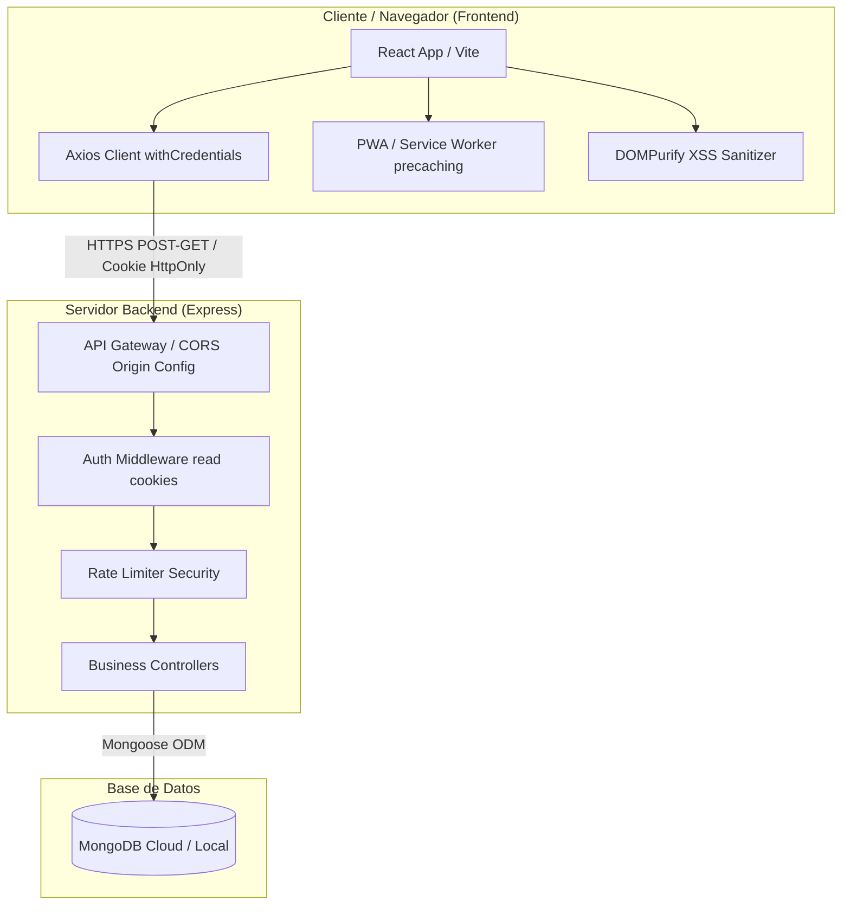

# Eventos JR - Frontend

[](https://github.com/ProyectoDWII/Eventos_JR_Front_End/actions/workflows/ci-frontend.yml)

Plataforma interactiva para la captura, planeación y gestión de eventos y cotizaciones de servicios de fotografía profesional. Diseñada con un enfoque premium, responsivo y cumpliendo con las regulaciones de la Ley General de Protección de Datos Personales (LGPDPPSO).

---

## 🗺️ Diagrama de Arquitectura de Software

La aplicación sigue una arquitectura cliente-servidor desacoplada que se comunica de forma segura mediante HTTPS y cookies HttpOnly.



---

## 🚀 Instrucciones de Ejecución Local

### Prerrequisitos
*   **Node.js** (Versión 18 o superior recomendada)
*   **npm** (Versión 9 o superior)

### 1. Clonar el Repositorio e Instalar Dependencias
```bash
git clone https://github.com/ProyectoDWII/Eventos_JR_Front_End.git
cd Eventos_JR_Front_End
npm install
```

### 2. Configurar Variables de Entorno
Crea un archivo `.env` en la raíz del proyecto (puedes guiarte de `.env.example`):
```env
VITE_API_URL=http://localhost:5000/api
```

### 3. Ejecutar en Modo Desarrollo
```bash
npm run dev
```
La aplicación estará disponible localmente en [http://localhost:5173](http://localhost:5173).

### 4. Compilar para Producción
Para compilar y optimizar el bundle estático del frontend:
```bash
npm run build
```

---

## 🐳 Ejecución con Docker

Si deseas ejecutar la aplicación utilizando contenedores Docker:

### Construir y levantar el contenedor
```bash
docker-compose up --build
```
*(Asegúrate de configurar las variables de entorno deseadas dentro de tu archivo `docker-compose.yml` o `.env`)*.

---

## 🔒 Credenciales de Prueba para Evaluación

Puedes utilizar los siguientes perfiles de prueba en tu entorno local para evaluar los diferentes roles de la aplicación:

| Rol de Usuario | Correo Electrónico | Contraseña | Permisos y Accesos |
| :--- | :--- | :--- | :--- |
| **Administrador / Fotógrafo** | `fotografo@eventosjr.com` | `fotografo123` | Control total, reportes, gestión de usuarios, carga de servicios. |
| **Cliente** | `cliente@eventosjr.com` | `cliente1234` | Ver catálogos, solicitar eventos, ver contratos, configurar perfil. |

> [!NOTE]
> Si estas cuentas no existen aún en tu base de datos local de MongoDB, puedes crearlas ingresando a la vista **Registrarse** en el menú superior del sitio y seleccionando el rol correspondiente.

---

## 🛠️ Pipeline de Integración Continua (GitHub Actions)

El repositorio cuenta con un pipeline de CI configurado en `.github/workflows/ci-frontend.yml` que se dispara automáticamente en cada Pull Request dirigido a `desarrollo` o `main`.

El pipeline ejecuta:
1.  **Instalación:** `npm ci` para descarga limpia de dependencias.
2.  **Formateo:** `npm run format:check` (Prettier).
3.  **Linter:** `npm run lint` (ESLint) para calidad de sintaxis.
4.  **Compilación:** `npm run build` para garantizar que no existan errores de empaquetado.

---

## 🔗 Enlace de Producción
La aplicación frontend se encuentra desplegada y lista para producción en el siguiente enlace:

👉 [Eventos JR - Aplicación en Producción](https://eventos-jr.vercel.app)
*(Nota: Reemplazar este enlace con la URL final de despliegue otorgada por tu hosting de producción, por ejemplo, Vercel o Netlify).*
